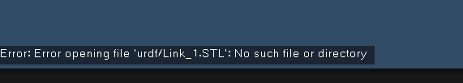
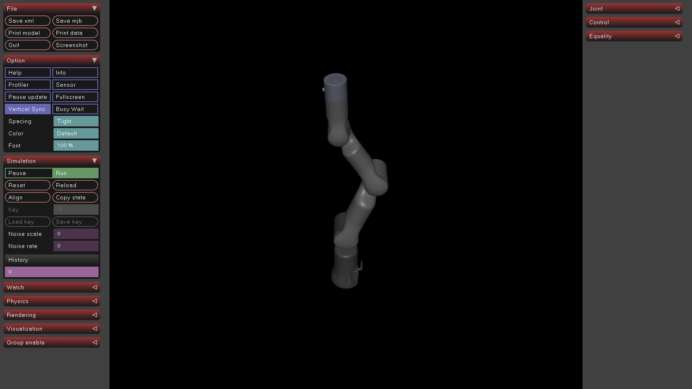
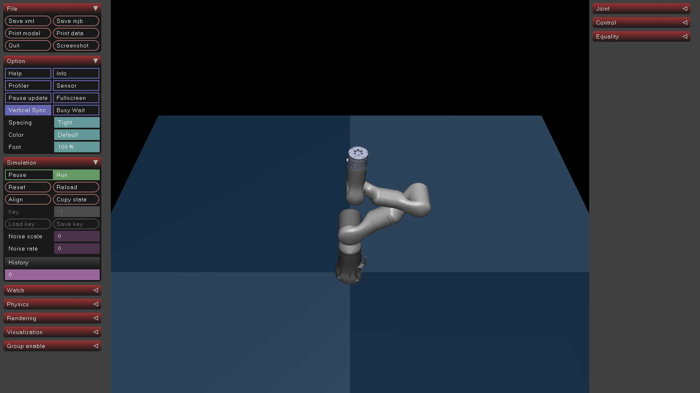

## mainfont: "Noto Serif CJK SC"

sansfont: "Noto Sans CJK SC"
monofont: "Noto Sans Mono CJK SC"

mujoco可以直接打开urdf文件的模型，第一步我们要确保的是urdf文件是否能正常打开。以65号机械臂模型为例

我们先输入代码，启动下载好的urdf文件模型

```
simulate urdf/RM65-6F.urdf
```



我们会发现出现以上错误，是因为网格文件无法找到，而在mujoco中，stl文件的路径并不取决与在urdf中所写的文件路径，他只会寻找所在文件夹下的stl文件。

如在下面这个urdf文件中，我们stl文件放在"package://robot_arm/meshes/Link_1.STL" ，用mujoco打开时发现文件无法识别。

```
 <geometry>
        <mesh
          filename="package://RM65-6F/meshes/Link_1.STL" />
      </geometry>
      <material
        name="">
        <color
          rgba="0.3 0.7 0.1 1" />
      </material>
    </visual>
    <collision>
      <origin
        xyz="0 0 0"
        rpy="0 0 0" />
      <geometry>
        <mesh
          filename="package://RM65-6F/meshes/Link_1.STL" />
```

**因此我们要将网格文件提前放置在urdf文件所在文件夹下，这样才可以保证他在mujoco中打开**

输入以下指令确保我们可以打开

```
simulate urdf/RM65-6F.urdf
```

成功打开后我们会看到以下情况，

</material>
成功打开后我们可以进行下一步转换格式

在mujoco中可以直接完成转化，有两个方法

方法一：在mujoco中打开后，点击左上角的保持 save xml 即可完成转化

方法二：运用以下代码，填写好输入和输出的路径即可

```
# convert_urdf.py
import mujoco
import os 

def convert_urdf_to_mujoco_xml(urdf_path, output_xml_path):
    """
    将 URDF 文件转换为 MuJoCo MJCF XML 文件。

    Args:
        urdf_path (str): 输入的 URDF 文件路径。
        output_xml_path (str): 输出的 MJCF XML 文件路径。
    """
    try:
        # 1. 从 URDF 文件加载模型。MuJoCo 的编译器会自动处理转换。
        # 这一步会在内存中创建一个 mujoco.MjModel 实例。
        print(f"正在加载 URDF 文件: {urdf_path}")
        model = mujoco.MjModel.from_xml_path(urdf_path)
        print("URDF 文件加载并编译成功。")

        # 2. 将最后编译的模型保存为 XML 字符串。
        # 这个函数会获取上一次编译操作（即 from_xml_path）的结果。
        # 如果模型无法编译，此函数将引发错误。
        xml_string = mujoco.mj_saveLastXML(output_xml_path, model)
  
        # mj_saveLastXML 已经将文件写入磁盘，这里只是为了确认
        if os.path.exists(output_xml_path):
            print(f"成功将模型保存为 MuJoCo XML 文件: {output_xml_path}")
        else:
            # 如果 mj_saveLastXML 由于某种原因失败（例如权限问题），则会进入这里
            raise IOError("mj_saveLastXML 未能创建文件。")

    except Exception as e:
        print(f"转换过程中发生错误: {e}")

if __name__ == '__main__':
    # 确保 simple_arm.urdf 文件和此脚本在同一目录下
    urdf_file = '/home/hmk/robot_arm/urdf/RM65-6F.urdf'
    xml_file = '/home/hmk/robot_arm/urdf/65.xml'
    convert_urdf_to_mujoco_xml(urdf_file, xml_file)


```

转化完成后，就可以直接打开了。

但在实际运用过程中，可能会出现网格文件找不到的问题，我们可以在下方输入相对或绝对路径，来解决。

```
<mujoco model="RM65-6F">
  <compiler angle="radian"/>

  <asset>
    <mesh name="Link_1" content_type="model/stl" file="Link_1.STL"/>
    <mesh name="Link_2" content_type="model/stl" file="Link_2.STL"/>
    <mesh name="Link_3" content_type="model/stl" file="Link_3.STL"/>
    <mesh name="Link_4" content_type="model/stl" file="Link_4.STL"/>
    <mesh name="Link_5" content_type="model/stl" file="Link_5.STL"/>
    <mesh name="Link_6" content_type="model/stl" file="Link_6.STL"/>
  </asset>
```

我们在下方file = 中即可修改路径。

完成以上步骤后，基本完成了urdf到mujf的转化，但是我们发现，mujoco中漆黑一片，因此我们需要添加光源，定义地面。

```
<asset>
    <texture name="grid" type="2d" builtin="checker" rgb1=".1 .2 .3" rgb2=".2 .3 .4"
      width="3000" height="3000" />
    <material name="grid" texture="grid" texrepeat="1 1" texuniform="true" />
  
```

我们先在在asset定义地面的材质，颜色，

然后在worldbody中，填写如下代码，即可定义地面与光源

```
 <!-- 添加光源 -->
    <light diffuse=".5 .5 .5" pos="0 0 100" dir="0 0 -1" />

    <!-- 地面 -->
    <geom type="plane" size="1 1 1" pos="0 0 0" material="grid" />
```

重新打开后如下图所示


